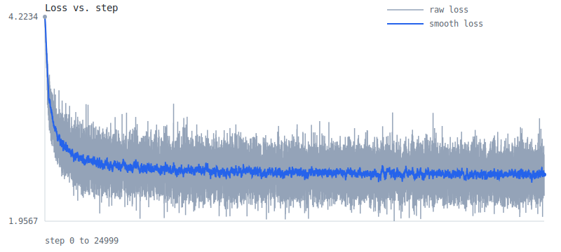
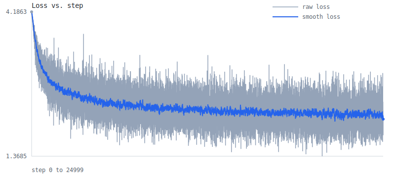
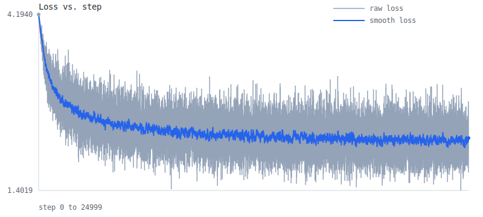

# Learning Log

Runs recorded on 2026-03-09.

## Summary

| Milestone | Script | Steps | Train Loss | Val Loss | Train Seconds | Steps/Sec | Total Seconds | CSV | Graph |
| --------- | ------ | ----: | ---------: | -------: | ------------: | --------: | ------------: | --- | ----- |
| 001 | `experiments/001_bigram_torch.py` | 0 | 2.454943 | - | - | - | 15.738 | [csv](../artifacts/experiments/001_bigram_torch/20260309_001835_287317/loss_history.csv) | [svg](../artifacts/experiments/001_bigram_torch/20260309_001835_287317/loss_curve.svg) |
| 001 | `experiments/001_bigram_bt.py` | 0 | 2.454943 | - | - | - | 2.306 | [csv](../artifacts/experiments/001_bigram_bt/20260309_001819_741240/loss_history.csv) | [svg](../artifacts/experiments/001_bigram_bt/20260309_001819_741240/loss_curve.svg) |
| 002 | `experiments/002_mlp_torch.py` | 25000 | 2.506999 | 2.532096 | 7.459 | 3351.694 | 8.185 | [csv](../artifacts/experiments/002_mlp_torch/20260309_001853_381825/loss_history.csv) | [svg](../artifacts/experiments/002_mlp_torch/20260309_001853_381825/loss_curve.svg) |
| 002 | `experiments/002_mlp_bt.py` | 25000 | 2.474183 | 2.507311 | 43.537 | 574.228 | 53.769 | [csv](../artifacts/experiments/002_mlp_bt/20260309_001950_630432/loss_history.csv) | [svg](../artifacts/experiments/002_mlp_bt/20260309_001950_630432/loss_curve.svg) |
| 003 | `experiments/003_context_window_linear_torch.py` | 25000 | 2.182514 | 2.251570 | 7.256 | 3445.247 | 8.286 | [csv](../artifacts/experiments/003_context_window_linear_torch/20260309_002002_855304/loss_history.csv) | [svg](../artifacts/experiments/003_context_window_linear_torch/20260309_002002_855304/loss_curve.svg) |
| 003 | `experiments/003_context_window_linear_bt.py` | 25000 | 2.185520 | 2.247977 | 40.335 | 619.808 | 63.844 | [csv](../artifacts/experiments/003_context_window_linear_bt/20260309_002110_007479/loss_history.csv) | [svg](../artifacts/experiments/003_context_window_linear_bt/20260309_002110_007479/loss_curve.svg) |

## 001 Bigram Torch

- Script: `experiments/001_bigram_torch.py`
- Steps: `0`
- Train loss: `2.454943`
- Val loss: `-`
- Total seconds: `15.738`


```text
heprs an tcede.
YEin, lanoul-see waindonse ate t,-bee wist ic wsoster; bea yonsenimser se ay g pourancey mou ber s LI'sl tem'ls tofr?

KESod, IAg thorvere nonifit deanche
Whatrerath; shan ise pls tode
```

## 001 Bigram BareTensor

- Script: `experiments/001_bigram_bt.py`
- Steps: `0`
- Train loss: `2.454943`
- Val loss: `-`
- Total seconds: `2.306`


```text
hepraray soulemy rs.
BARCEEThrelorgutidst EE:
Ty,
Y:
A ye! od,
ORThy menthir, wom in:

Cavaly ke poik he cuirowowirf manoweantorvelatend

YOUTy whanganind wis th mage theas be INGle fomis ENTINADWhest
```

## 002 MLP Torch

- Script: `experiments/002_mlp_torch.py`
- Steps: `25000`
- Train loss: `2.506999`
- Val loss: `2.532096`
- Train seconds: `7.459`
- Steps per second: `3351.694`
- Total seconds: `8.185`


```text
hent, ofim cothis, ant t sacitheat yo winor d boudem ndalert nd ie hates shy w?
S:

HENRY: may owuleistsorestr GI bllates, ha aily h vimisiltwichis ng p'd's so urny ie, y bred rein reshe byowisean ave
```

## 002 MLP BareTensor

- Script: `experiments/002_mlp_bt.py`
- Steps: `25000`
- Train loss: `2.474183`
- Val loss: `2.507311`
- Train seconds: `43.537`
- Steps per second: `574.228`
- Total seconds: `53.769`



```text
heprarby sprchesens.
B:

AMyesherentth wo EE:
Sy,
Wel:
lldor masothy menthir, wom in:

Cavaly le poil he by outrthen manmy intorvenat:
H awhouw whang:
S:
Aven th nced thecod ce oould s, t ELO:


OMavi
```

## 003 Context-Window Linear Torch

- Script: `experiments/003_context_window_linear_torch.py`
- Steps: `25000`
- Train loss: `2.182514`
- Val loss: `2.251570`
- Train seconds: `7.256`
- Steps per second: `3445.247`
- Total seconds: `8.286`



```text
to as way dove thave t cnos?

BORL:
I whts hay. 
FINK:
But las,
Wh rrat.

Ase wide

Wive morey; myous and tyour thes eeand,
Fhan ou tho buster youn grime but liast mowndlevey youribe sow thes bot! sav
```

## 003 Context-Window Linear BareTensor

- Script: `experiments/003_context_window_linear_bt.py`
- Steps: `25000`
- Train loss: `2.185520`
- Val loss: `2.247977`
- Train seconds: `40.335`
- Steps per second: `619.808`
- Total seconds: `63.844`



```text
to aurast omy sould wist re hald, wirpeovis wo We;
Ty Bulk Surdor marnght meethead, whand Yalls evand rif dece yourtry:
Sancentaleites ofelle
AsUTly will.

QMENdES:
The ch vingig.

AULINEARESCA,
Sela?
```
