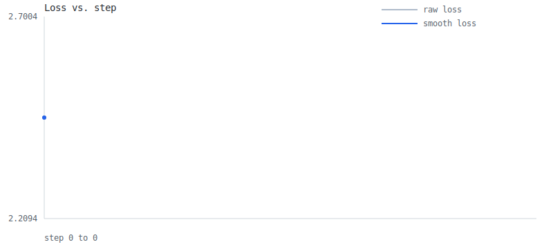
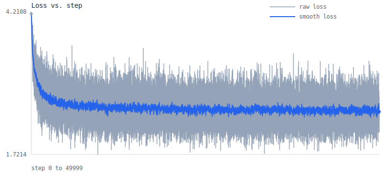
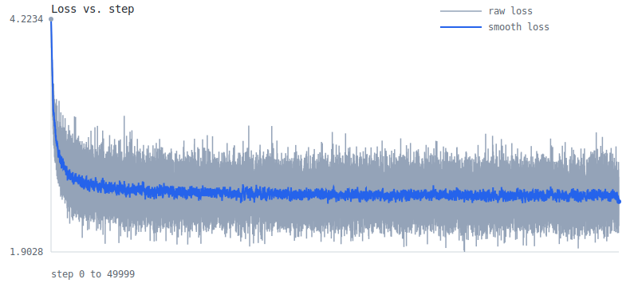
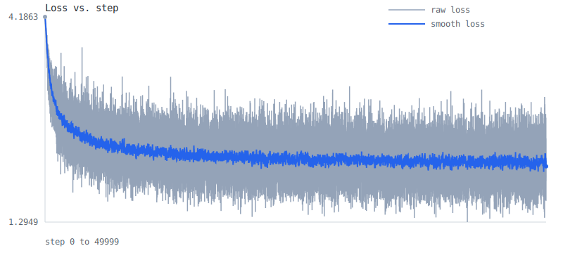
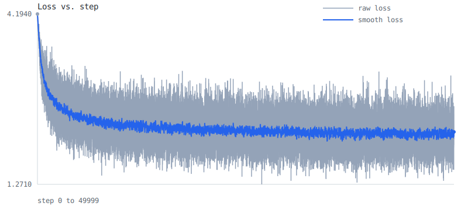
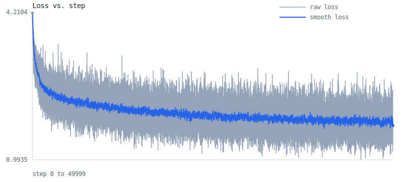
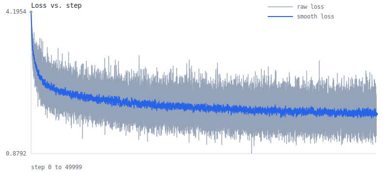
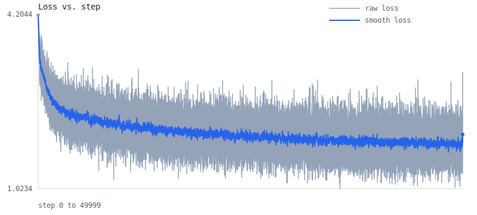
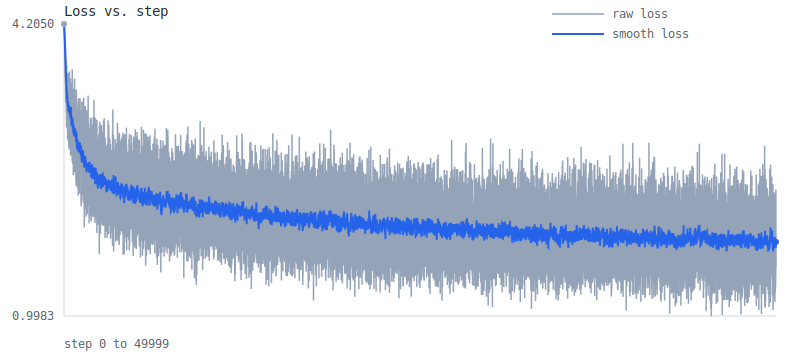

# Learning Log

Runs recorded on 2026-03-09, 2026-03-12, and 2026-03-14.

## Summary

| Milestone | Script | Steps | Train Loss | Val Loss | Train Seconds | Steps/Sec | Total Seconds | CSV | Graph |
| --------- | ------ | ----: | ---------: | -------: | ------------: | --------: | ------------: | --- | ----- |
| 001 | `experiments/001_bigram_torch.py` | 0 | 2.454943 | - | - | - | 15.738 | [csv](../artifacts/experiments/001_bigram_torch/20260309_001835_287317/loss_history.csv) | [svg](../artifacts/experiments/001_bigram_torch/20260309_001835_287317/loss_curve.svg) |
| 001 | `experiments/001_bigram_bt.py` | 0 | 2.454943 | - | - | - | 2.306 | [csv](../artifacts/experiments/001_bigram_bt/20260309_001819_741240/loss_history.csv) | [svg](../artifacts/experiments/001_bigram_bt/20260309_001819_741240/loss_curve.svg) |
| 002 | `experiments/002_mlp_torch.py` | 50000 | 2.488925 | 2.523084 | 18.423 | 2713.927 | 19.376 | [csv](../artifacts/experiments/002_mlp_torch/20260312_003442_834071/loss_history.csv) | [svg](../artifacts/experiments/002_mlp_torch/20260312_003442_834071/loss_curve.svg) |
| 002 | `experiments/002_mlp_bt.py` | 50000 | 2.466264 | 2.502053 | 120.537 | 414.812 | 128.662 | [csv](../artifacts/experiments/002_mlp_bt/20260314_130209_063051/loss_history.csv) | [svg](../artifacts/experiments/002_mlp_bt/20260314_130209_063051/loss_curve.svg) |
| 003 | `experiments/003_context_window_linear_torch.py` | 50000 | 2.129700 | 2.229607 | 19.724 | 2534.987 | 20.977 | [csv](../artifacts/experiments/003_context_window_linear_torch/20260312_003712_975024/loss_history.csv) | [svg](../artifacts/experiments/003_context_window_linear_torch/20260312_003712_975024/loss_curve.svg) |
| 003 | `experiments/003_context_window_linear_bt.py` | 50000 | 2.132292 | 2.228308 | 109.017 | 458.643 | 138.307 | [csv](../artifacts/experiments/003_context_window_linear_bt/20260314_130431_398530/loss_history.csv) | [svg](../artifacts/experiments/003_context_window_linear_bt/20260314_130431_398530/loss_curve.svg) |
| 004 | `experiments/004_context_window_mlp_torch.py` | 50000 | 1.818081 | 1.962587 | 26.318 | 1899.823 | 28.124 | [csv](../artifacts/experiments/004_context_window_mlp_torch/20260312_004008_912442/loss_history.csv) | [svg](../artifacts/experiments/004_context_window_mlp_torch/20260312_004008_912442/loss_curve.svg) |
| 004 | `experiments/004_context_window_mlp_bt.py` | 50000 | 1.820442 | 1.953616 | 146.785 | 340.635 | 181.585 | [csv](../artifacts/experiments/004_context_window_mlp_bt/20260314_130738_748028/loss_history.csv) | [svg](../artifacts/experiments/004_context_window_mlp_bt/20260314_130738_748028/loss_curve.svg) |
| 005 | `experiments/005_larger_context_mlp_torch.py` | 50000 | 1.831950 | 1.990602 | 46.127 | 1083.960 | 50.157 | [csv](../artifacts/experiments/005_larger_context_mlp_torch/20260312_112822_814813/loss_history.csv) | [svg](../artifacts/experiments/005_larger_context_mlp_torch/20260312_112822_814813/loss_curve.svg) |
| 005 | `experiments/005_larger_context_mlp_bt.py` | 50000 | 1.823935 | 1.987984 | 615.386 | 81.250 | 757.687 | [csv](../artifacts/experiments/005_larger_context_mlp_bt/20260314_132023_262099/loss_history.csv) | [svg](../artifacts/experiments/005_larger_context_mlp_bt/20260314_132023_262099/loss_curve.svg) |

BareTensor reruns on 2026-03-14 use the optimized `Release` build without any BLAS/Accelerate `matmul` fast path.

## 001 Bigram Torch

- Script: `experiments/001_bigram_torch.py`
- Steps: `0`
- Train loss: `2.454943`
- Val loss: `-`
- Total seconds: `15.738`



```text
heprs an tcede.
YEin, lanoul-see waindonse ate t,-bee wist ic wsoster; bea yonsenimser se ay g pourancey mou ber s LI'sl tem'ls tofr?

KESod, IAg thorvere nonifit deanche
Whatrerath; shan ise pls tode
```

## 001 Bigram BareTensor

- Script: `experiments/001_bigram_bt.py`
- Steps: `0`
- Train loss: `2.454943`
- Val loss: `-`
- Total seconds: `2.306`


```text
hepraray soulemy rs.
BARCEEThrelorgutidst EE:
Ty,
Y:
A ye! od,
ORThy menthir, wom in:

Cavaly ke poik he cuirowowirf manoweantorvelatend

YOUTy whanganind wis th mage theas be INGle fomis ENTINADWhest
```

## 002 MLP Torch

- Script: `experiments/002_mlp_torch.py`
- Steps: `50000`
- Train loss: `2.488925`
- Val loss: `2.523084`
- Train seconds: `18.423`
- Steps per second: `2713.927`
- Total seconds: `19.376`



```text
h.
K:
D:
I wely,

Ant fug, adicondayokend fampow
ALERKESgnd st;


RLAurthontoman ble m Yong he ceshas id o bel. we d iblee he-poteemad owis, or pele theames w t wane is th w ly s thakeldBundeadaversh
```

## 002 MLP BareTensor

- Script: `experiments/002_mlp_bt.py`
- Steps: `50000`
- Train loss: `2.466264`
- Val loss: `2.502053`
- Train seconds: `120.537`
- Steps per second: `414.812`
- Total seconds: `128.662`



```text
henome,--kitangrenrde GLANEThorerelyou wo GABNUze
XERD yg. paparothy memykir, wol ke PENTo fu le shak in,
tarowovell manowe:
Wirvelatend

Whity wigenanhe even th nage ureas be INGinamingo ENRDY bonest
```

## 003 Context-Window Linear Torch

- Script: `experiments/003_context_window_linear_torch.py`
- Steps: `50000`
- Train loss: `2.129700`
- Val loss: `2.229607`
- Train seconds: `19.724`
- Steps per second: `2534.987`
- Total seconds: `20.977`



```text
to as noveretang he.

GUREO:
Hew ant dt ard.
Whe turosthea not striek liscoul, them,
If RI IAvistoegof,
Lion comm-ablithe atir too my wil cenor divent majenje:
Tow thithe,
Warkeny, and ssedwath.

HAR
```

## 003 Context-Window Linear BareTensor

- Script: `experiments/003_context_window_linear_bt.py`
- Steps: `50000`
- Train loss: `2.132292`
- Val loss: `2.228308`
- Train seconds: `109.017`
- Steps per second: `458.643`
- Total seconds: `138.307`



```text
to aurenoghay sould, lowenc.

FLORY:
Shevor wo ala, yo the ay hot leerint
Potshis pute llabe to gualinge,
And by outise, I beove itrexcommand
At: ty willake:
Hewis so le mathe.

CEMEO:
Mfaredie
Fore c
```

## 004 Context-Window MLP Torch

- Script: `experiments/004_context_window_mlp_torch.py`
- Steps: `50000`
- Train loss: `1.818081`
- Val loss: `1.962587`
- Train seconds: `26.318`
- Steps per second: `1899.823`
- Total seconds: `28.124`



```text
to alf brither hod ridlenfentle Etwardie ant me:
Fall; let of it are my his my and ooct then to my lest hy yall getorst withun Broubluith' Gis!

Mithee than we with, on youl defrenctlick, andicatund m
```

## 004 Context-Window MLP BareTensor

- Script: `experiments/004_context_window_mlp_bt.py`
- Steps: `50000`
- Train loss: `1.820442`
- Val loss: `1.953616`
- Train seconds: `146.785`
- Steps per second: `340.635`
- Total seconds: `181.585`



```text
to as ople:
is to live uppe in evereitherse wold aghy Kong Lut that splew onerish too and aalls
ExEN:
Rome, me your; wher of to live you the Adwersw will for inton that bodrs, thap and me shel I parce
```

## 005 Larger-Context MLP Torch

- Script: `experiments/005_larger_context_mlp_torch.py`
- Steps: `50000`
- Train loss: `1.831950`
- Val loss: `1.990602`
- Train seconds: `46.127`
- Steps per second: `1083.960`
- Total seconds: `50.157`



```text
to account this I livemys of thin be you moo in woilser, sects'd sayest,
That to homes in fir eeverest ceintase lives and Serfory,
Peave it heaved, the foo my preat he Ladqunes
go she dirn, tad in cri
```

## 005 Larger-Context MLP BareTensor

- Script: `experiments/005_larger_context_mlp_bt.py`
- Steps: `50000`
- Train loss: `1.823935`
- Val loss: `1.987984`
- Train seconds: `615.386`
- Steps per second: `81.250`
- Total seconds: `757.687`



```text
to account this witherbey spon, whise.

FLIET:
Now tout woh,
Ammy Cpare your breish. And with sure lifd,
To hoe, and cand by sturungland.
The worten, doo at tow will for hewer that andbosis chafier,
F
```
