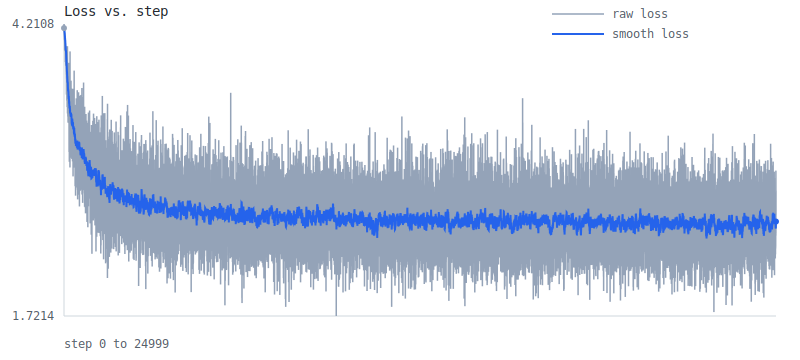

# Learning Log

Runs recorded on 2026-03-08.

## Summary

| Milestone | Script                                   | Steps | Train Loss | Val Loss | CSV | Graph |
| --------- | ---------------------------------------- | ----: | ---------: | -------: | --- | ----- |
| 001       | `experiments/001_bigram_torch.py`        |     0 |   2.454943 |        - | [csv](../artifacts/experiments/001_bigram_torch/20260308_205532_438053/loss_history.csv) | [svg](../artifacts/experiments/001_bigram_torch/20260308_205532_438053/loss_curve.svg) |
| 001       | `experiments/001_bigram_bt.py`           |     0 |   2.454943 |        - | [csv](../artifacts/experiments/001_bigram_bt/20260308_205512_062261/loss_history.csv) | [svg](../artifacts/experiments/001_bigram_bt/20260308_205512_062261/loss_curve.svg) |
| 002       | `experiments/002_mlp_torch.py`           | 25000 |   2.506999 | 2.532096 | [csv](../artifacts/experiments/002_mlp_torch/20260308_205554_199412/loss_history.csv) | [svg](../artifacts/experiments/002_mlp_torch/20260308_205554_199412/loss_curve.svg) |
| 002       | `experiments/002_mlp_bt.py`              | 25000 |   2.474183 | 2.507311 | [csv](../artifacts/experiments/002_mlp_bt/20260308_205717_738961/loss_history.csv) | [svg](../artifacts/experiments/002_mlp_bt/20260308_205717_738961/loss_curve.svg) |
| 003       | `experiments/003_context_window_linear_torch.py` | 25000 |   2.182514 | 2.251570 | [csv](../artifacts/experiments/003_context_window_linear_torch/20260308_205617_412932/loss_history.csv) | [svg](../artifacts/experiments/003_context_window_linear_torch/20260308_205617_412932/loss_curve.svg) |

## 001 Bigram Torch

- Script: `experiments/001_bigram_torch.py`
- Steps: `0`
- Train loss: `2.454943`
- Val loss: `-`


```text
heprs an tcede.
YEin, lanoul-see waindonse ate t,-bee wist ic wsoster; bea yonsenimser se ay g pourancey mou ber s LI'sl tem'ls tofr?

KESod, IAg thorvere nonifit deanche
Whatrerath; shan ise pls tode
```

## 001 Bigram BareTensor

- Script: `experiments/001_bigram_bt.py`
- Steps: `0`
- Train loss: `2.454943`
- Val loss: `-`


```text
hepraray soulemy rs.
BARCEEThrelorgutidst EE:
Ty,
Y:
A ye! od,
ORThy menthir, wom in:

Cavaly ke poik he cuirowowirf manoweantorvelatend

YOUTy whanganind wis th mage theas be INGle fomis ENTINADWhest
```

## 002 MLP Torch

- Script: `experiments/002_mlp_torch.py`
- Steps: `25000`
- Train loss: `2.506999`
- Val loss: `2.532096`



```text
hent, ofim cothis, ant t sacitheat yo winor d boudem ndalert nd ie hates shy w?
S:

HENRY: may owuleistsorestr GI bllates, ha aily h vimisiltwichis ng p'd's so urny ie, y bred rein reshe byowisean ave
```

## 002 MLP BareTensor

- Script: `experiments/002_mlp_bt.py`
- Steps: `25000`
- Train loss: `2.474183`
- Val loss: `2.507311`


```text
heprarby sprchesens.
B:

AMyesherentth wo EE:
Sy,
Wel:
lldor masothy menthir, wom in:

Cavaly le poil he by outrthen manmy intorvenat:
H awhouw whang:
S:
Aven th nced thecod ce oould s, t ELO:


OMavi
```

## 003 Context-Window Linear Torch

- Script: `experiments/003_context_window_linear_torch.py`
- Steps: `25000`
- Train loss: `2.182514`
- Val loss: `2.251570`


```text
to as way dove thave t cnos?

BORL:
I whts hay. 
FINK:
But las,
Wh rrat.

Ase wide

Wive morey; myous and tyour thes eeand,
Fhan ou tho buster youn grime but liast mowndlevey youribe sow thes bot! sav
```
