# Learning Log

Runs recorded on 2026-03-09, 2026-03-12, 2026-03-14, 2026-03-15, 2026-03-16, 2026-03-21, 2026-03-22, and 2026-03-23.

## Summary

| Milestone | Script | Steps | Train Loss | Val Loss | Train Seconds | Steps/Sec | Total Seconds | CSV | Graph |
| --------- | ------ | ----: | ---------: | -------: | ------------: | --------: | ------------: | --- | ----- |
| 001 | `experiments/001_bigram_torch.py` | 0 | 2.454943 | - | - | - | 15.738 | [csv](../artifacts/experiments/001_bigram_torch/20260309_001835_287317/loss_history.csv) | [svg](../artifacts/experiments/001_bigram_torch/20260309_001835_287317/loss_curve.svg) |
| 001 | `experiments/001_bigram_bt.py` | 0 | 2.454943 | - | - | - | 2.306 | [csv](../artifacts/experiments/001_bigram_bt/20260309_001819_741240/loss_history.csv) | [svg](../artifacts/experiments/001_bigram_bt/20260309_001819_741240/loss_curve.svg) |
| 001 | `experiments/001_bigram_jax.py` | 0 | 2.454943 | - | - | - | 2.709 | [csv](../artifacts/experiments/001_bigram_jax/20260316_002802_607381/loss_history.csv) | [svg](../artifacts/experiments/001_bigram_jax/20260316_002802_607381/loss_curve.svg) |
| 002 | `experiments/002_mlp_torch.py` | 50000 | 2.488925 | 2.523084 | 18.423 | 2713.927 | 19.376 | [csv](../artifacts/experiments/002_mlp_torch/20260312_003442_834071/loss_history.csv) | [svg](../artifacts/experiments/002_mlp_torch/20260312_003442_834071/loss_curve.svg) |
| 002 | `experiments/002_mlp_bt.py` | 50000 | 2.466264 | 2.502053 | 120.537 | 414.812 | 128.662 | [csv](../artifacts/experiments/002_mlp_bt/20260314_130209_063051/loss_history.csv) | [svg](../artifacts/experiments/002_mlp_bt/20260314_130209_063051/loss_curve.svg) |
| 002 | `experiments/002_mlp_jax.py` | 50000 | 2.487126 | 2.521707 | 5.609 | 8914.785 | 11.283 | [csv](../artifacts/experiments/002_mlp_jax/20260316_002814_677671/loss_history.csv) | [svg](../artifacts/experiments/002_mlp_jax/20260316_002814_677671/loss_curve.svg) |
| 003 | `experiments/003_context_window_linear_torch.py` | 50000 | 2.129700 | 2.229607 | 19.724 | 2534.987 | 20.977 | [csv](../artifacts/experiments/003_context_window_linear_torch/20260312_003712_975024/loss_history.csv) | [svg](../artifacts/experiments/003_context_window_linear_torch/20260312_003712_975024/loss_curve.svg) |
| 003 | `experiments/003_context_window_linear_bt.py` | 50000 | 2.132292 | 2.228308 | 109.017 | 458.643 | 138.307 | [csv](../artifacts/experiments/003_context_window_linear_bt/20260314_130431_398530/loss_history.csv) | [svg](../artifacts/experiments/003_context_window_linear_bt/20260314_130431_398530/loss_curve.svg) |
| 003 | `experiments/003_context_window_linear_jax.py` | 50000 | 2.127830 | 2.230438 | 10.309 | 4850.070 | 16.009 | [csv](../artifacts/experiments/003_context_window_linear_jax/20260316_002831_740947/loss_history.csv) | [svg](../artifacts/experiments/003_context_window_linear_jax/20260316_002831_740947/loss_curve.svg) |
| 004 | `experiments/004_context_window_mlp_torch.py` | 50000 | 1.818081 | 1.962587 | 26.318 | 1899.823 | 28.124 | [csv](../artifacts/experiments/004_context_window_mlp_torch/20260312_004008_912442/loss_history.csv) | [svg](../artifacts/experiments/004_context_window_mlp_torch/20260312_004008_912442/loss_curve.svg) |
| 004 | `experiments/004_context_window_mlp_bt.py` | 50000 | 1.820442 | 1.953616 | 146.785 | 340.635 | 181.585 | [csv](../artifacts/experiments/004_context_window_mlp_bt/20260314_130738_748028/loss_history.csv) | [svg](../artifacts/experiments/004_context_window_mlp_bt/20260314_130738_748028/loss_curve.svg) |
| 004 | `experiments/004_context_window_mlp_jax.py` | 50000 | 1.818015 | 1.963075 | 12.338 | 4052.608 | 19.239 | [csv](../artifacts/experiments/004_context_window_mlp_jax/20260316_002852_051364/loss_history.csv) | [svg](../artifacts/experiments/004_context_window_mlp_jax/20260316_002852_051364/loss_curve.svg) |
| 005 | `experiments/005_larger_context_mlp_torch.py` | 50000 | 1.831950 | 1.990602 | 46.127 | 1083.960 | 50.157 | [csv](../artifacts/experiments/005_larger_context_mlp_torch/20260312_112822_814813/loss_history.csv) | [svg](../artifacts/experiments/005_larger_context_mlp_torch/20260312_112822_814813/loss_curve.svg) |
| 005 | `experiments/005_larger_context_mlp_bt.py` | 50000 | 1.823935 | 1.987984 | 615.386 | 81.250 | 757.687 | [csv](../artifacts/experiments/005_larger_context_mlp_bt/20260314_132023_262099/loss_history.csv) | [svg](../artifacts/experiments/005_larger_context_mlp_bt/20260314_132023_262099/loss_curve.svg) |
| 005 | `experiments/005_larger_context_mlp_jax.py` | 50000 | 1.829704 | 1.987969 | 26.703 | 1872.426 | 40.417 | [csv](../artifacts/experiments/005_larger_context_mlp_jax/20260316_002933_560488/loss_history.csv) | [svg](../artifacts/experiments/005_larger_context_mlp_jax/20260316_002933_560488/loss_curve.svg) |
| 006 | `experiments/006_vanilla_rnn_torch.py` | 50000 | 1.876595 | 2.006060 | 117.845 | 424.285 | 119.276 | [csv](../artifacts/experiments/006_vanilla_rnn_torch/20260315_001102_953260/loss_history.csv) | [svg](../artifacts/experiments/006_vanilla_rnn_torch/20260315_001102_953260/loss_curve.svg) |
| 006 | `experiments/006_vanilla_rnn_bt.py` | 50000 | 1.872256 | 2.000917 | 820.450 | 60.942 | 832.126 | [csv](../artifacts/experiments/006_vanilla_rnn_bt/20260315_143054_193678/loss_history.csv) | [svg](../artifacts/experiments/006_vanilla_rnn_bt/20260315_143054_193678/loss_curve.svg) |
| 006 | `experiments/006_vanilla_rnn_jax.py` | 50000 | 1.871434 | 1.995282 | 122.540 | 408.030 | 130.278 | [csv](../artifacts/experiments/006_vanilla_rnn_jax/20260316_003145_981115/loss_history.csv) | [svg](../artifacts/experiments/006_vanilla_rnn_jax/20260316_003145_981115/loss_curve.svg) |
| 007 | `experiments/007_vanilla_rnn_torch.py` | 50000 | 1.914339 | 2.028619 | 289.001 | 173.010 | 289.713 | [csv](../artifacts/experiments/007_vanilla_rnn_torch/20260316_101512_850050/loss_history.csv) | [svg](../artifacts/experiments/007_vanilla_rnn_torch/20260316_101512_850050/loss_curve.svg) |
| 007 | `experiments/007_vanilla_rnn_bt.py` | 50000 | 1.912805 | 2.025120 | 1726.394 | 28.962 | 1737.701 | [csv](../artifacts/experiments/007_vanilla_rnn_bt/20260316_165311_175541/loss_history.csv) | [svg](../artifacts/experiments/007_vanilla_rnn_bt/20260316_165311_175541/loss_curve.svg) |
| 007 | `experiments/007_vanilla_rnn_jax.py` | 50000 | 1.923394 | 2.025352 | 184.648 | 270.786 | 188.270 | [csv](../artifacts/experiments/007_vanilla_rnn_jax/20260316_195745_191033/loss_history.csv) | [svg](../artifacts/experiments/007_vanilla_rnn_jax/20260316_195745_191033/loss_curve.svg) |
| 008 | `experiments/008_gru_torch.py` | 50000 | 1.973407 | 2.026830 | 698.317 | 71.601 | 699.691 | [csv](../artifacts/experiments/008_gru_torch/20260316_234646_086430/loss_history.csv) | [svg](../artifacts/experiments/008_gru_torch/20260316_234646_086430/loss_curve.svg) |
| 008 | `experiments/008_gru_jax.py` | 50000 | 1.978897 | 2.031622 | 290.632 | 172.039 | 294.285 | [csv](../artifacts/experiments/008_gru_jax/20260316_235249_013574/loss_history.csv) | [svg](../artifacts/experiments/008_gru_jax/20260316_235249_013574/loss_curve.svg) |
| 009 | `experiments/009_single_head_attention_torch.py` | 100000 | 2.456635 | 2.478268 | 180.380 | 554.384 | 217.976 | [csv](../artifacts/experiments/009_single_head_attention_torch/20260321_100630_174512/loss_history.csv) | [svg](../artifacts/experiments/009_single_head_attention_torch/20260321_100630_174512/loss_curve.svg) |
| 009 | `experiments/009_single_head_attention_jax.py` | 100000 | 2.458452 | 2.484670 | 305.335 | 327.509 | 541.878 | [csv](../artifacts/experiments/009_single_head_attention_jax/20260321_095756_487781/loss_history.csv) | [svg](../artifacts/experiments/009_single_head_attention_jax/20260321_095756_487781/loss_curve.svg) |
| 010 | `experiments/010_single_head_attention_torch.py` | 100000 | 2.445969 | 2.474077 | 247.082 | 404.724 | 297.885 | [csv](../artifacts/experiments/010_single_head_attention_torch/20260321_230943_099467/loss_history.csv) | [svg](../artifacts/experiments/010_single_head_attention_torch/20260321_230943_099467/loss_curve.svg) |
| 010 | `experiments/010_single_head_attention_jax.py` | 100000 | 2.463586 | 2.487816 | 320.054 | 312.447 | 496.636 | [csv](../artifacts/experiments/010_single_head_attention_jax/20260321_231810_874023/loss_history.csv) | [svg](../artifacts/experiments/010_single_head_attention_jax/20260321_231810_874023/loss_curve.svg) |
| 011 | `experiments/011_attention_residual_jax.py` | 100000 | 2.315200 | 2.356931 | 276.444 | 361.737 | 332.165 | [csv](../artifacts/experiments/011_attention_residual_jax/20260322_091010_566218/loss_history.csv) | [svg](../artifacts/experiments/011_attention_residual_jax/20260322_091010_566218/loss_curve.svg) |
| 012 | `experiments/012_attention_residual_layer_norm_jax.py` | 100000 | 2.182534 | 2.259682 | 252.862 | 395.473 | 297.579 | [csv](../artifacts/experiments/012_attention_residual_layer_norm_jax/20260322_125705_316057/loss_history.csv) | [svg](../artifacts/experiments/012_attention_residual_layer_norm_jax/20260322_125705_316057/loss_curve.svg) |
| 013 | `experiments/013_attention_residual_layer_norm_ffn_jax.py` | 100000 | 1.690038 | 1.878318 | 432.607 | 231.157 | 504.172 | [csv](../artifacts/experiments/013_attention_residual_layer_norm_ffn_jax/20260322_200628_017070/loss_history.csv) | [svg](../artifacts/experiments/013_attention_residual_layer_norm_ffn_jax/20260322_200628_017070/loss_curve.svg) |
| 014 | `experiments/014_single_block_decoder_only_transformer_jax.py` | 100000 | 1.686884 | 1.873174 | 411.317 | 243.122 | 483.435 | [csv](../artifacts/experiments/014_single_block_decoder_only_transformer_jax/20260323_011612_784899/loss_history.csv) | [svg](../artifacts/experiments/014_single_block_decoder_only_transformer_jax/20260323_011612_784899/loss_curve.svg) |
| 015 | `experiments/015_single_block_multi_head_decoder_only_transformer_jax.py` | 100000 | 1.822181 | 1.956108 | 681.613 | 146.711 | 804.293 | [csv](../artifacts/experiments/015_single_block_multi_head_decoder_only_transformer_jax/20260323_184835_096532/loss_history.csv) | [svg](../artifacts/experiments/015_single_block_multi_head_decoder_only_transformer_jax/20260323_184835_096532/loss_curve.svg) |
| 016 | `experiments/016_small_multi_layer_decoder_jax.py` | 100000 | 1.624889 | 1.826635 | 817.049 | 61.196 | 1025.764 | [csv](../artifacts/experiments/016_small_multi_layer_decoder_jax/20260324_002448_334792/loss_history.csv) | [svg](../artifacts/experiments/016_small_multi_layer_decoder_jax/20260324_002448_334792/loss_curve.svg) |

BareTensor reruns on 2026-03-14 use the optimized `Release` build without any BLAS/Accelerate `matmul` fast path.

## 001 Bigram Torch

- Script: `experiments/001_bigram_torch.py`
- Steps: `0`
- Train loss: `2.454943`
- Val loss: `-`
- Total seconds: `15.738`


```text
heprs an tcede.
YEin, lanoul-see waindonse ate t,-bee wist ic wsoster; bea yonsenimser se ay g pourancey mou ber s LI'sl tem'ls tofr?

KESod, IAg thorvere nonifit deanche
Whatrerath; shan ise pls tode
```

## 001 Bigram BareTensor

- Script: `experiments/001_bigram_bt.py`
- Steps: `0`
- Train loss: `2.454943`
- Val loss: `-`
- Total seconds: `2.306`


```text
hepraray soulemy rs.
BARCEEThrelorgutidst EE:
Ty,
Y:
A ye! od,
ORThy menthir, wom in:

Cavaly ke poik he cuirowowirf manoweantorvelatend

YOUTy whanganind wis th mage theas be INGle fomis ENTINADWhest
```

## 001 Bigram JAX

- Script: `experiments/001_bigram_jax.py`
- Steps: `0`
- Train loss: `2.454943`
- Val loss: `-`
- Total seconds: `2.709`


```text
S:
G,
hantrol your?
Than ICENGLInonfouearwhealinowincausthe ecthe hef pen ayoveourent ch have fomy;
Nond p th dey DWhive icofesot ca ird sau f LUST:
OLUGLONUCHEB.

Tokeieray wes'
Goumo serubun myear,
```

## 002 MLP Torch

- Script: `experiments/002_mlp_torch.py`
- Steps: `50000`
- Train loss: `2.488925`
- Val loss: `2.523084`
- Train seconds: `18.423`
- Steps per second: `2713.927`
- Total seconds: `19.376`

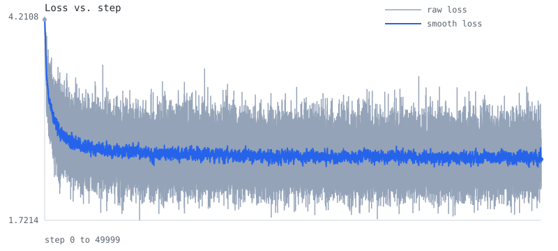

```text
h.
K:
D:
I wely,

Ant fug, adicondayokend fampow
ALERKESgnd st;


RLAurthontoman ble m Yong he ceshas id o bel. we d iblee he-poteemad owis, or pele theames w t wane is th w ly s thakeldBundeadaversh
```

## 002 MLP BareTensor

- Script: `experiments/002_mlp_bt.py`
- Steps: `50000`
- Train loss: `2.466264`
- Val loss: `2.502053`
- Train seconds: `120.537`
- Steps per second: `414.812`
- Total seconds: `128.662`


```text
henome,--kitangrenrde GLANEThorerelyou wo GABNUze
XERD yg. paparothy memykir, wol ke PENTo fu le shak in,
tarowovell manowe:
Wirvelatend

Whity wigenanhe even th nage ureas be INGinamingo ENRDY bonest
```

## 002 MLP JAX

- Script: `experiments/002_mlp_jax.py`
- Steps: `50000`
- Train loss: `2.487126`
- Val loss: `2.521707`
- Train seconds: `5.609`
- Steps per second: `8914.785`
- Total seconds: `11.283`

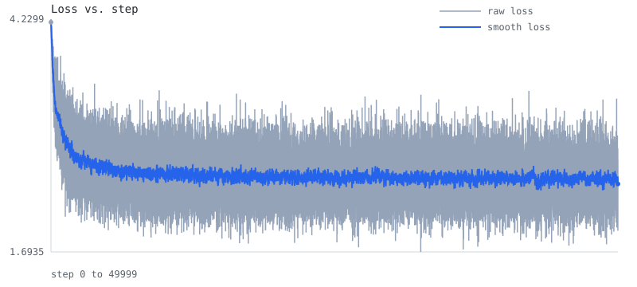

```text
d ERGe thorryowofr,
MEldeselotpy,'llveng wot ouchal, cowowowh faest batsthak, gan oteVe oous-orlis ak, ssant
Ou leg t, hu hame?
ULe colthin delo ,
CL:
IGagowentt n.
Th gourayo
ERTha serelofot t is we
```

## 003 Context-Window Linear Torch

- Script: `experiments/003_context_window_linear_torch.py`
- Steps: `50000`
- Train loss: `2.129700`
- Val loss: `2.229607`
- Train seconds: `19.724`
- Steps per second: `2534.987`
- Total seconds: `20.977`


```text
to as noveretang he.

GUREO:
Hew ant dt ard.
Whe turosthea not striek liscoul, them,
If RI IAvistoegof,
Lion comm-ablithe atir too my wil cenor divent majenje:
Tow thithe,
Warkeny, and ssedwath.

HAR
```

## 003 Context-Window Linear BareTensor

- Script: `experiments/003_context_window_linear_bt.py`
- Steps: `50000`
- Train loss: `2.132292`
- Val loss: `2.228308`
- Train seconds: `109.017`
- Steps per second: `458.643`
- Total seconds: `138.307`

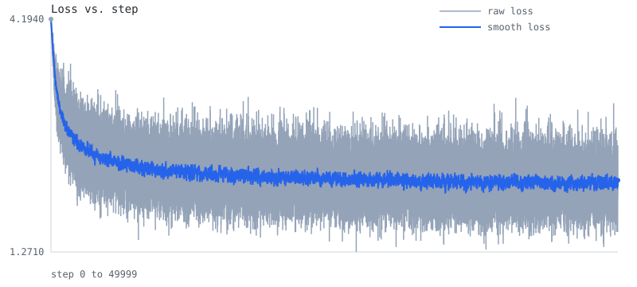

```text
to aurenoghay sould, lowenc.

FLORY:
Shevor wo ala, yo the ay hot leerint
Potshis pute llabe to gualinge,
And by outise, I beove itrexcommand
At: ty willake:
Hewis so le mathe.

CEMEO:
Mfaredie
Fore c
```

## 003 Context-Window Linear JAX

- Script: `experiments/003_context_window_linear_jax.py`
- Steps: `50000`
- Train loss: `2.127830`
- Val loss: `2.230438`
- Train seconds: `10.309`
- Steps per second: `4850.070`
- Total seconds: `16.009`

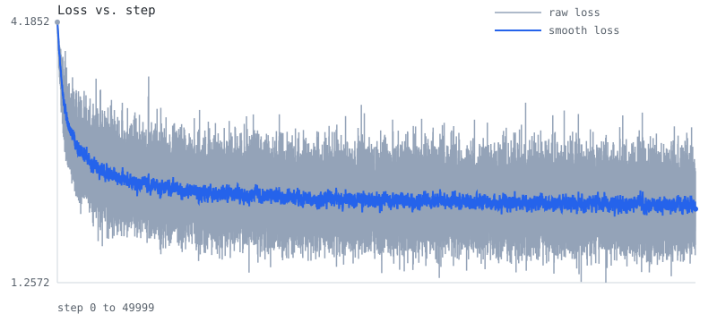

```text
re ofrele thor your sord,
Forech:
Tu'llveng int Sech, mo berisch foes buthst,
Tur an thewerowis.

QUENENLUS:
If to log th he ham shlyes mothen deave,
thee dag of ht be ther spayou hey fotreson, worven
```

## 004 Context-Window MLP Torch

- Script: `experiments/004_context_window_mlp_torch.py`
- Steps: `50000`
- Train loss: `1.818081`
- Val loss: `1.962587`
- Train seconds: `26.318`
- Steps per second: `1899.823`
- Total seconds: `28.124`

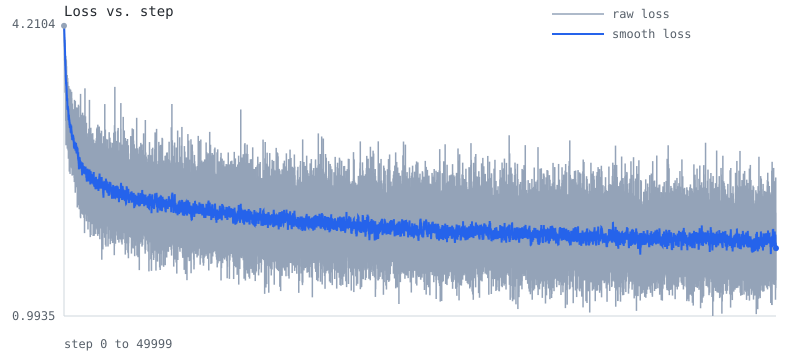

```text
to alf brither hod ridlenfentle Etwardie ant me:
Fall; let of it are my his my and ooct then to my lest hy yall getorst withun Broubluith' Gis!

Mithee than we with, on youl defrenctlick, andicatund m
```

## 004 Context-Window MLP BareTensor

- Script: `experiments/004_context_window_mlp_bt.py`
- Steps: `50000`
- Train loss: `1.820442`
- Val loss: `1.953616`
- Train seconds: `146.785`
- Steps per second: `340.635`
- Total seconds: `181.585`


```text
to as ople:
is to live uppe in evereitherse wold aghy Kong Lut that splew onerish too and aalls
ExEN:
Rome, me your; wher of to live you the Adwersw will for inton that bodrs, thap and me shel I parce
```

## 004 Context-Window MLP JAX

- Script: `experiments/004_context_window_mlp_jax.py`
- Steps: `50000`
- Train loss: `1.818015`
- Val loss: `1.963075`
- Train seconds: `12.338`
- Steps per second: `4052.608`
- Total seconds: `19.239`

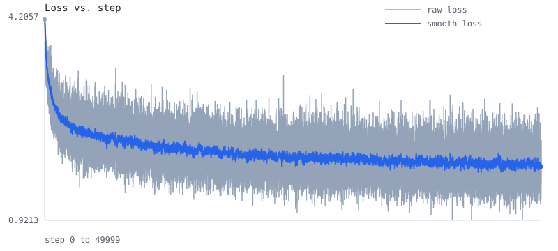

```text
re of slean, swiat agard:
For chaple'll kno wort, chal, so mise heads abous facurian of we alise plife:
As sawles, my worms. Sweet, ye colt?

AUYOLI,
But to good had we to Lort of our free,
Bnow this
```

## 005 Larger-Context MLP Torch

- Script: `experiments/005_larger_context_mlp_torch.py`
- Steps: `50000`
- Train loss: `1.831950`
- Val loss: `1.990602`
- Train seconds: `46.127`
- Steps per second: `1083.960`
- Total seconds: `50.157`


```text
to account this I livemys of thin be you moo in woilser, sects'd sayest,
That to homes in fir eeverest ceintase lives and Serfory,
Peave it heaved, the foo my preat he Ladqunes
go she dirn, tad in cri
```

## 005 Larger-Context MLP BareTensor

- Script: `experiments/005_larger_context_mlp_bt.py`
- Steps: `50000`
- Train loss: `1.823935`
- Val loss: `1.987984`
- Train seconds: `615.386`
- Steps per second: `81.250`
- Total seconds: `757.687`


```text
to account this witherbey spon, whise.

FLIET:
Now tout woh,
Ammy Cpare your breish. And with sure lifd,
To hoe, and cand by sturungland.
The worten, doo at tow will for hewer that andbosis chafier,
F
```

## 005 Larger-Context MLP JAX

- Script: `experiments/005_larger_context_mlp_jax.py`
- Steps: `50000`
- Train loss: `1.829704`
- Val loss: `1.987969`
- Train seconds: `26.703`
- Steps per second: `1872.426`
- Total seconds: `40.417`

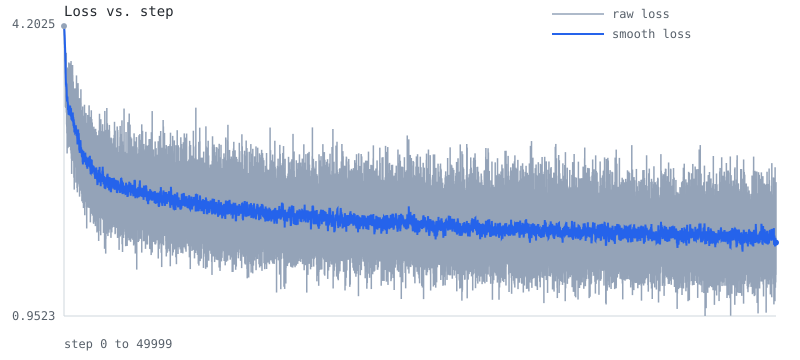

```text
ee on thy way:
Harruce torry word,
Maldow; Rope,'ll know me Sich hen of wher faeld bots fake gave teen of this is a pastarl, of that montire thlyes: his nod vak,
Come you well deme to Lort of oly hord
```

## 006 Vanilla RNN Torch

- Script: `experiments/006_vanilla_rnn_torch.py`
- Steps: `50000`
- Train loss: `1.876595`
- Val loss: `2.006060`
- Train seconds: `117.845`
- Steps per second: `424.285`
- Total seconds: `119.276`

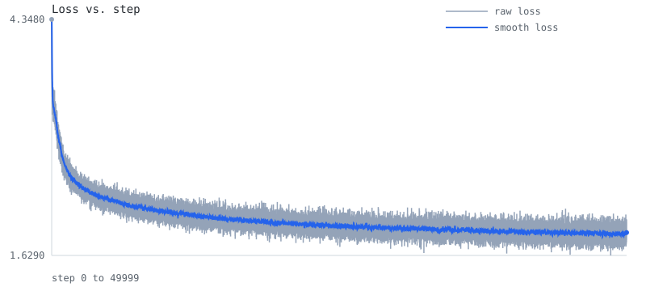

```text
ting were and slaive shaplfy, an
Is then, somy;
In yaur, O, the pay stincesite so meaclous sars' poak?
But 'dow lord in ondures deed:
King, and,
ands.

DUSKINGAR:

vike
Ameh!
Is mane ivou swean?
We tw
```

## 006 Vanilla RNN BareTensor

- Script: `experiments/006_vanilla_rnn_bt.py`
- Steps: `50000`
- Train loss: `1.872256`
- Val loss: `2.000917`
- Train seconds: `820.450`
- Steps per second: `60.942`
- Total seconds: `832.126`


```text
to not piver; be therefo, a crown.

Muspaymace coze, do Rusirfer spirver quisilks?

KING OMIALY:
I mone in dy; to: son of triedry which siads, wrath lopion furratl of lay:
I:
Be,
She give, I foop boon
```

## 006 Vanilla RNN JAX

- Script: `experiments/006_vanilla_rnn_jax.py`
- Steps: `50000`
- Train loss: `1.871434`
- Val loss: `1.995282`
- Train seconds: `122.540`
- Steps per second: `408.030`
- Total seconds: `130.278`

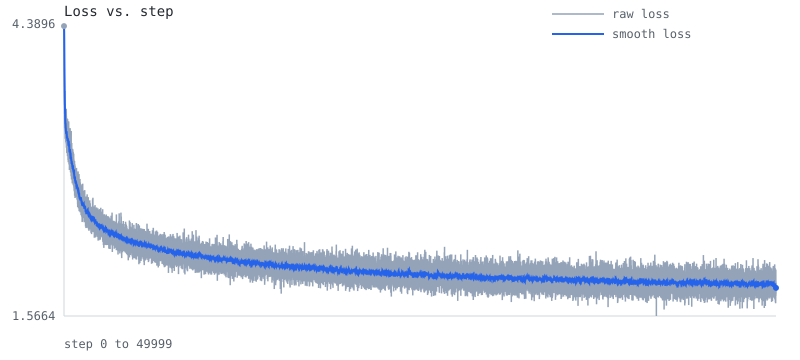

```text
s Edle courry that,
My reself:
Thellven: whit, chall conmisch foese bats and that the proods--

ULEENE:
Haw thouldgry, huth me?
lyess his not lor,
Cucety, and then. Vither:
Woald, from my foigh is wel
```

## 007 Vanilla RNN Torch

- Script: `experiments/007_vanilla_rnn_torch.py`
- Steps: `50000`
- Train loss: `1.914339`
- Val loss: `2.028619`
- Train seconds: `289.001`
- Steps per second: `173.010`
- Total seconds: `289.713`


```text
to account this world but hell,
Until my mis-shaped trunk that benef;
They congef woldught,
And hered,
Yeneds stord.

These prous and.

ThRENq:
Ann that dommy lake the I have ir flord as ad of Oxceing
```

## 007 Vanilla RNN BareTensor

- Script: `experiments/007_vanilla_rnn_bt.py`
- Steps: `50000`
- Train loss: `1.912805`
- Val loss: `2.025120`
- Train seconds: `1726.394`
- Steps per second: `28.962`
- Total seconds: `1737.701`

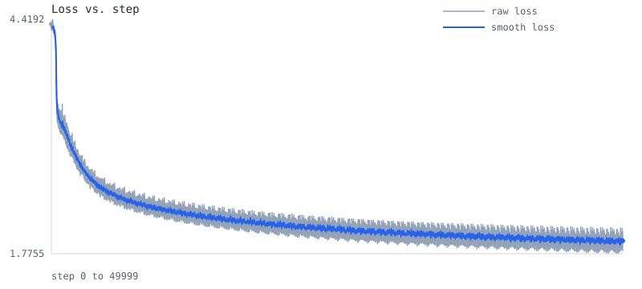

```text
to account this world but hell,
Until my mis-shaped trunk that but to pixisking's roond
I eathot they. Cyod cally Gtay awonoul,
Soirt
Sirthinedss and Yoths fuefolge;
And dullowserfich lowd hoves of hi
```

## 007 Vanilla RNN JAX

- Script: `experiments/007_vanilla_rnn_jax.py`
- Steps: `50000`
- Train loss: `1.923394`
- Val loss: `2.025352`
- Train seconds: `184.648`
- Steps per second: `270.786`
- Total seconds: `188.270`

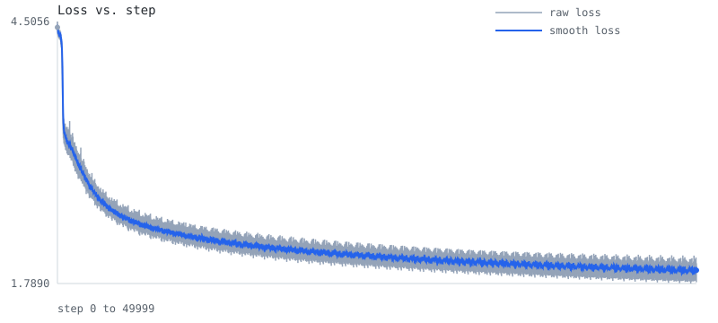

```text
r spurr'd their coursers at the trumpet's sound;
With them, the hasbioghes Lord I day to love luck', what of of have botter a'd geen.
He cans now wowllds: car'd to vithere axk, be connung't the demed
```

## 008 GRU Torch

- Script: `experiments/008_gru_torch.py`
- Steps: `50000`
- Train loss: `1.973407`
- Val loss: `2.026830`
- Train seconds: `698.317`
- Steps per second: `71.601`
- Total seconds: `699.691`

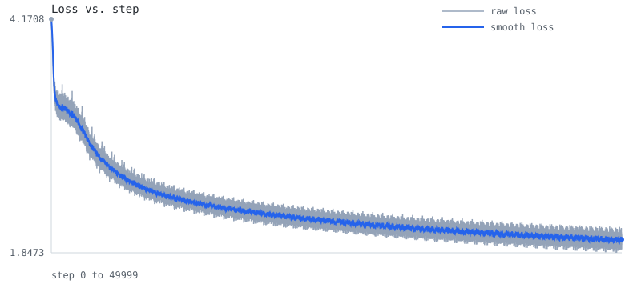

```text
to account this world but hell,
Until my mis-shaped trunk that bees vath lors the sud.

'CPOivean reselt, the canst the laglougl of ale nade soins.

BLADD EOD::
Thally have velrnd.

LOMENUD:
And love 
```

## 008 GRU JAX

- Script: `experiments/008_gru_jax.py`
- Steps: `50000`
- Train loss: `1.978897`
- Val loss: `2.031622`
- Train seconds: `290.632`
- Steps per second: `172.039`
- Total seconds: `294.285`

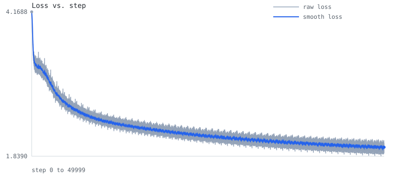

```text
r spurr'd their coursers at the trumpet's sound;
With them, the hasboo's, for wele why or'd hold:
Sell.
Nor to heprecait us a'd gettan eack songlesom on to ce'd torve woue axjouds, whee wrow fary tey.
```

## 009 Single-Head Attention Torch

- Script: `experiments/009_single_head_attention_torch.py`
- Steps: `100000`
- Train loss: `2.456635`
- Val loss: `2.478268`
- Train seconds: `180.380`
- Steps per second: `554.384`
- Total seconds: `217.976`


```text
to account this world but hell,
Until my mis-shaped trunk that baly, bet, tow pey po
ULoterwim
II one tesu trsainthepons t w ay Bulanot.
ICO bachoudeal Sar.G brloucte teadlyU: aid t
I Thereat tobpe my
```

## 009 Single-Head Attention JAX

- Script: `experiments/009_single_head_attention_jax.py`
- Steps: `100000`
- Train loss: `2.458452`
- Val loss: `2.484670`
- Train seconds: `305.335`
- Steps per second: `327.509`
- Total seconds: `541.878`


```text
 give pardon to a slave?
My brother slew no man; his fault was te tas alisus me.
K fu orth by hes I bllth userithyour ping torso, bpenge ma geet, ve,
Thiton s es ay s thayato t hou atomy t te m he; se
```

## 010 Single-Head Attention Torch

- Script: `experiments/010_single_head_attention_torch.py`
- Steps: `100000`
- Train loss: `2.445969`
- Val loss: `2.474077`
- Train seconds: `247.082`
- Steps per second: `404.724`
- Total seconds: `297.885`


```text
to account this world but hell,
Until my mis-shaped trunk that be s by Vou pomenerd tather he torder atis s thars Co ent:
I le feeeachart, ls f cerayose omy ts, woit, Fore p;
EThand t, ad y y gor psha
```

## 010 Single-Head Attention JAX

- Script: `experiments/010_single_head_attention_jax.py`
- Steps: `100000`
- Train loss: `2.463586`
- Val loss: `2.487816`
- Train seconds: `320.054`
- Steps per second: `312.447`
- Total seconds: `496.636`


```text
 give pardon to a slave?
My brother slew no man; his fault was te tas alisus me.
K fu ores by hes I bshat userithyoureping tors houpenge ma geet, ve,
Thiton s es ay s thayato t hou atomy t te m he lse
```

## 011 Attention + Residual JAX

- Script: `experiments/011_attention_residual_jax.py`
- Steps: `100000`
- Train loss: `2.315200`
- Val loss: `2.356931`
- Train seconds: `276.444`
- Steps per second: `361.737`
- Total seconds: `332.165`


```text
 give pardon to a slave?
My brother slew no man; his fault was teataldalisus me.


IOLBEOPEOLEY:
I Ishat usermellour ping lors houpe
Thesp geeerkve, ousellas es ayour
Foua, t ie s Diory t te m henlde
```

## 012 Attention + Residual + LayerNorm JAX

- Script: `experiments/012_attention_residual_layer_norm_jax.py`
- Steps: `100000`
- Train loss: `2.182534`
- Val loss: `2.259682`
- Train seconds: `252.862`
- Steps per second: `395.473`
- Total seconds: `297.579`


```text
 give pardon to a slave?
My brother slew no man; his fault was tokeas alldu the.


IOLBEOPEO:
Y thershat ugermesl; geping tors houpenge ma geet, vereous tans eang tor
Foraic Eizes stoof thee m notlee
```

## 013 Attention + Residual + LayerNorm + FFN JAX

- Script: `experiments/013_attention_residual_layer_norm_ffn_jax.py`
- Steps: `100000`
- Train loss: `1.690038`
- Val loss: `1.878318`
- Train seconds: `432.607`
- Steps per second: `231.157`
- Total seconds: `504.172`


```text
 give pardon to a slave?
My brother slew no man; his fault was to tallay suf Lord, fueell-be you nor shalluse me loth ping do some peon!

Pealet, vermons thas eangy seamfears ciesed
someh reevess wish
```

## 014 Single-Block Decoder-Only Transformer JAX

- Script: `experiments/014_single_block_decoder_only_transformer_jax.py`
- Steps: `100000`
- Train loss: `1.686884`
- Val loss: `1.873174`
- Train seconds: `411.317`
- Steps per second: `243.122`
- Total seconds: `483.435`


```text
 give pardon to a slave?
My brother slew no man; his fault was to tallagagurd,
All fule'd henot saters, he sermeol,
Wheing to so, be the master in me.

ISe Esles a to they No Eigh I so; hi te more; se
```

## 015 Single-Block Multi-Head Decoder-Only Transformer JAX

- Script: `experiments/015_single_block_multi_head_decoder_only_transformer_jax.py`
- Steps: `100000`
- Train loss: `1.822181`
- Val loss: `1.956108`
- Train seconds: `681.613`
- Steps per second: `146.711`
- Total seconds: `804.293`


```text
 give pardon to a slave?
My brother slew no man; his fault was to tas aursurr,
The fule thee wend Iellf,
Tusend by bothing lorsoved that ma glee,
To bodieltass? nay sermfeato ' hourss of thee mone;
Th
```

## 016 Small Multi-Layer Decoder JAX

- Script: `experiments/016_small_multi_layer_decoder_jax.py`
- Steps: `100000`
- Train loss: `1.624889`
- Val loss: `1.826635`
- Train seconds: `817.049`
- Steps per second: `61.196`
- Total seconds: `1025.764`

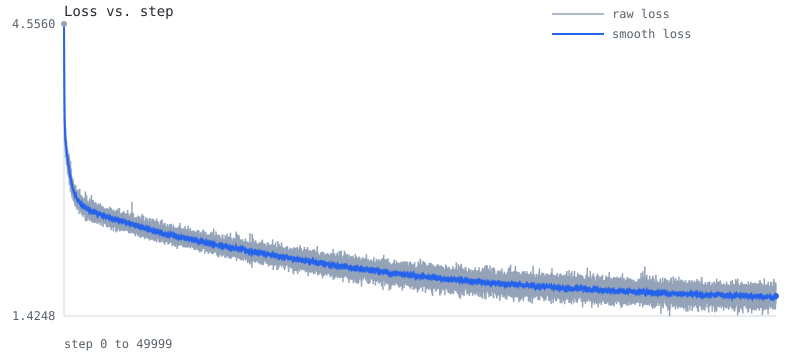

```text
e, that is meant love.

CAPULET:
How now, how now, chop-logic! What nate manone!
Come, murd, where night or Clizen:
Oncaraget and, mandombles us onentive
A foull good wither to too moinon's on him.

K
```
